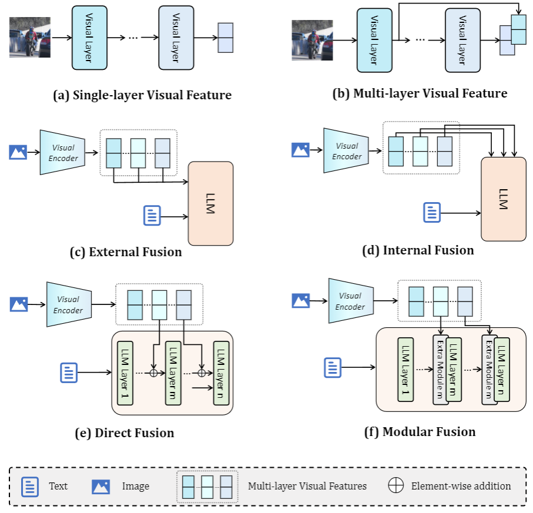

# Multi-Layer Visual Feature Fusion in Multimodal LLMs: Methods, Analysis, and Best Practices


This repository contains the code for the paper **"Multi-Layer Visual Feature Fusion in Multimodal LLMs: Methods, Analysis, and Best Practices"**. All the code is adapted from the [official **LLaVA** repository](https://github.com/haotian-liu/LLaVA). Follow the instructions below to set up the environment, prepare datasets, and reproduce the results. 


<p align="center" width="100%">
<a target="_blank"></a>
</p>

---

## Installation

To set up the environment, run the following commands:

```bash
conda create -n llava python=3.10 -y
conda activate llava
pip install --upgrade pip  # enable PEP 660 support
pip install -e .
```

## Preparation
### Training Data
For our experiments, we primarily use the **LLaVA-1.5** training dataset, which can be prepared following the [official guidelines](https://github.com/haotian-liu/LLaVA#train). 

Additionally, for the fine-tuning stage, we conducted experiments with the **737k subset** from **Cambrian-1**, part of the Cambrian-10M dataset. This dataset is available on [Hugging Face](https://huggingface.co/datasets/nyu-visionx/Cambrian-10M).


### Models Used

The following models, all available on [Hugging Face](https://huggingface.co), are used in our experiments:

**CLIP**: OpenAI's CLIP models, such as `openai/clip-vit-large-patch14-336`.
**SigLIP**: Enhanced visual encoders, such as `google/siglip-so400m-patch14-384`.
**MobileLLaMA**: Lightweight LLMs, including:
  - `mtgv/MobileLLaMA-1.4B-Base`
  - `mtgv/MobileLLaMA-2.7B-Base`


Ensure the datasets and model checkpoints are prepared according to their respective guidelines.


## Training

Our training approach consists of two stages: **pretraining** and **fine-tuning**. The training process is configured via the following shell script:

### Script

The training script is located at:

```
scripts/MLVF/train.sh
```

#### Variables

- `FUSING_STRATEGY`: Defines the fusion strategy. Options include:
  - `E_D`: External Direct Fusion
  - `E_M`: External Modular Fusion
  - `I_D`: Internal Direct Fusion
  - `I_M`: Internal Modular Fusion
- `USING_STRATEGY`: Specifies the layer selection strategy. Options include:
  - `18`: Selects layer 18.
  - `3-18`: Selects layers 3 and 18.
  - `3-18-23`: Selects layers 3, 18, and 23.
  - `former`: Uses the first 12 layers.
  - `latter`: Uses the last 12 layers.
  - `all`: Uses all layers.
- `MODEL_NAME`: A specific model identifier in the format `{Visual Encoder}_{LLM size}_{Dataset size}`. For example:
  - `siglip_14_665k`: SigLIP visual encoder, MobileLLaMA 1.4B, fine-tuning dataset size of 665k.


### Example

Below is an example for training:

```bash
# Define common variables
FUSING_STRATEGY="I_D"
USING_STRATEGY="3-18-23"
BASE_MODEL_NAME="llava"
MODEL_NAME="siglip_14_665k"

# Define paths
PRETRAIN_DATA_PATH="./playground/data/LLaVA-Pretrain/blip_laion_cc_sbu_558k.json"
PRETRAIN_IMAGE_FOLDER="./playground/data/LLaVA-Pretrain/images"
MODEL_PATH="mtgv/MobileLLaMA-1.4B-Base"
VISION_TOWER="google/siglip-so400m-patch14-384"
FINETUNE_DATA_PATH="./playground/data/llava_v1_5_mix665k.json"
FINETUNE_IMAGE_FOLDER="./playground/data"
```

Run the pretraining and fine-tuning commands included in the `train.sh` script.


## Evaluation

**Evaluation Framework**:
The script uses the [lmms-eval](https://github.com/EvolvingLMMs-Lab/lmms-eval) framework to evaluate models.

### Script

The evaluation script is located at:

```
scripts/MLVF/eval_toolkits/eval.sh
```

Define your model paths in the `models` array. Currently, it is set up for a single model:

```bash
models=(
     "/path/to/model"  # Replace with your model path
    )
```


